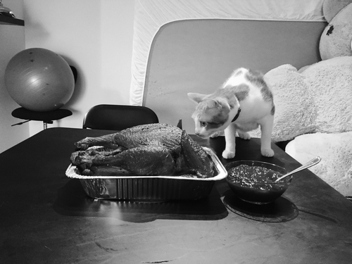
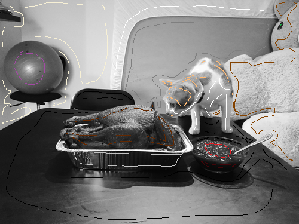
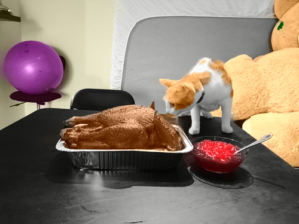
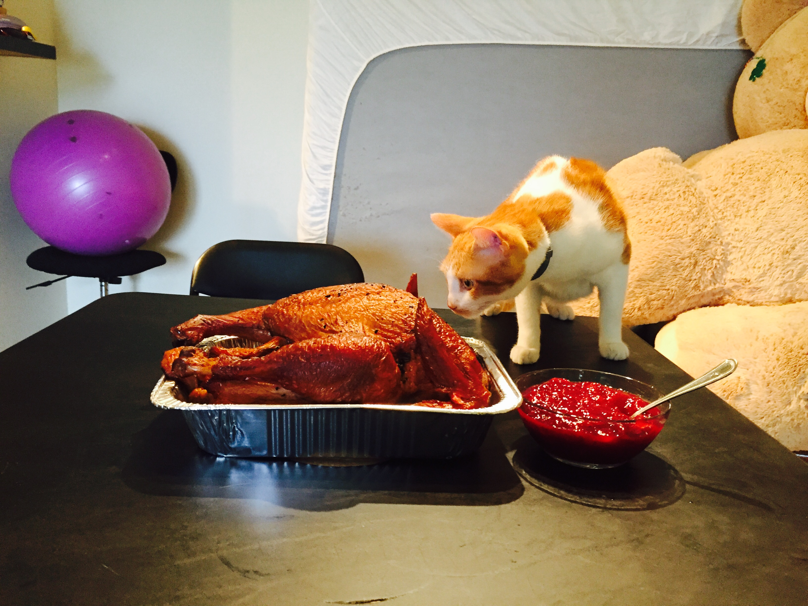

# Author: xwang875
1. The colorization algorithm is implemented in the Colorization.py file
2. Please keep the source image (original BW image and scribble marked image) under the same file with main.py and Colorization.py
3. To execute the code, just execude the main.py
4. To test with extra image, please modify the main.py by adding source file name in the program.
## Show Case
